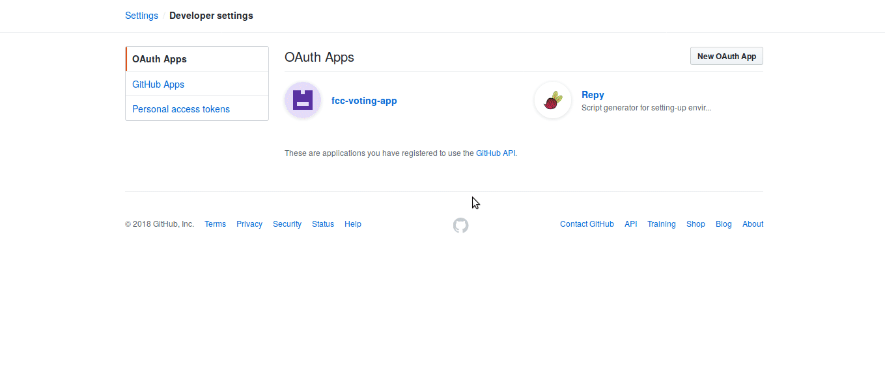
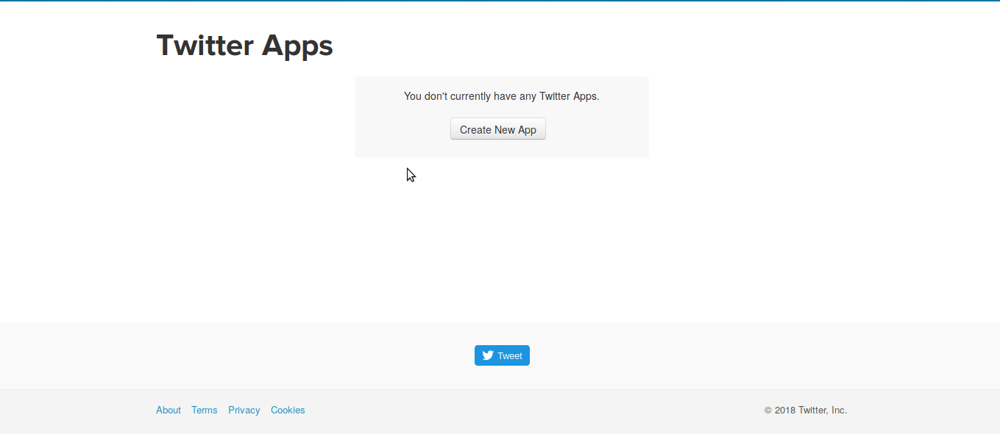
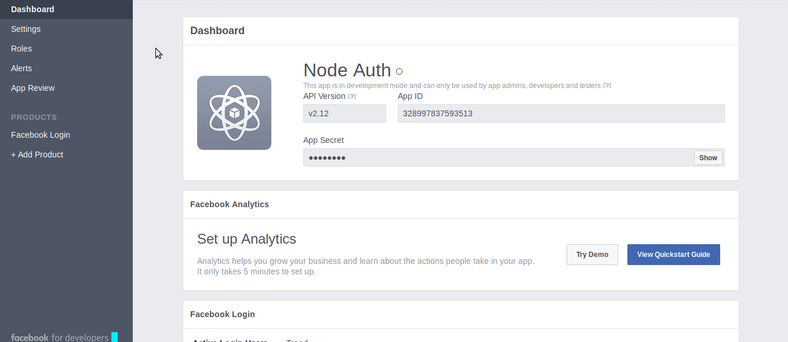
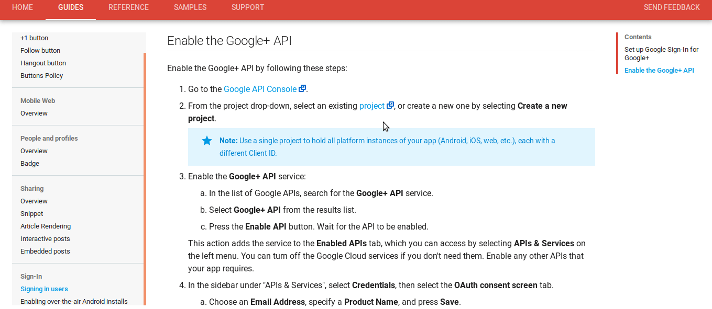
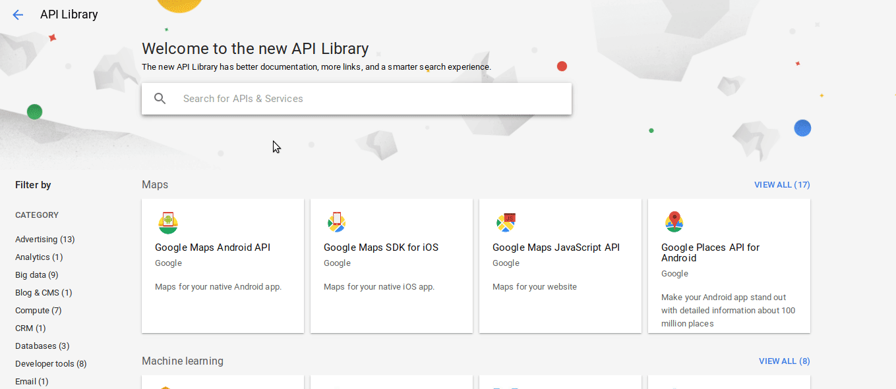
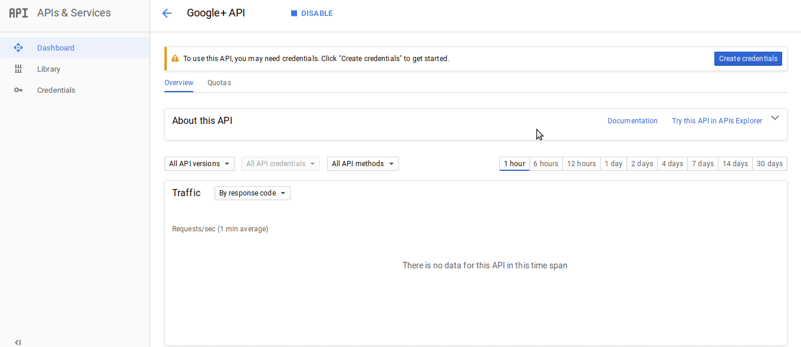

## Creating an App for Authentication

The authentication process is managed with [passportjs](http://www.passportjs.org) which simplifies this task. But to make it work we need to create an app. Below, there are instructions about how to create an app for authentication with some of the most used social network:

* [Github](#github)
* [Twitter](#twitter)
* [Facebook](#facebook)
* [Google](#google)

In these cases the domain URL is http://localhost:8080 and the callback is http://localhost:8080/api/user/auth/[socialNetwork]/callback.

### Github

Go to https://github.com/settings/developers and select "New OAuth App" then follow the instructions below.

### Twitter

Go to https://apps.twitter.com/ and select "Create New App" then follow the instructions below.

### Facebook

Go to https://developers.facebook.com/ and at the right upper corner go to "My Apps" > "Add a New App". Set a display name and create a new app. Go to the "Dashboard" and follow the instructions below to setup.

### Google

Go tohttps://console.developers.google.com/project/_/apiui/apis/library and follow the instructions below.

Select an existing project, or create a new one by selecting "Create a new project".

Search for "Google+ API" and enable it.

Lastly go to "Credentials" to setup a new client ID.

